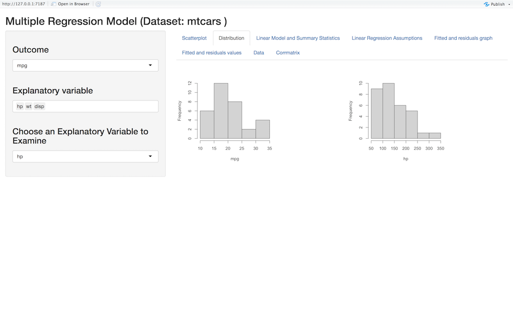
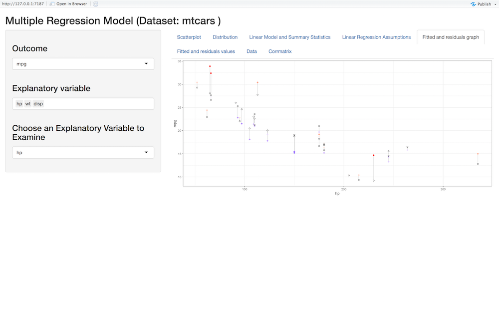

# Interactive Regression Models with Interreg Package 

The goal of interreg package is to provide a fast and friendly way to create an interactive shiny app for fitting simple linear, multiple linear, and stepwise regression models.
 
# Details

In the shiny app, there will be tabs to navigate the different uses of the shiny app. Here are some examples using the mtcars data set on the multiple regression function:

To arrive at the popup shown below the user must input multreg(mtcars).
Once that line of code is run, a page to display a visualization will appear with the choices of inputs on the side of the popup window.:


Then as the user clicks the tabs they will be moved to the different outputs that can be given. 





**Install interreg package**

To download this package use the following code.

```{r}

#install interreg package
if (!require(interreg)) {
 install.packages("interreg")
}
devtools::install_github("aaldarmaki9/interreg", build_vignettes = TRUE)
```
The source code is available [here](https://github.com/aaldarmaki/interreg).


Date created | December 11 2020


