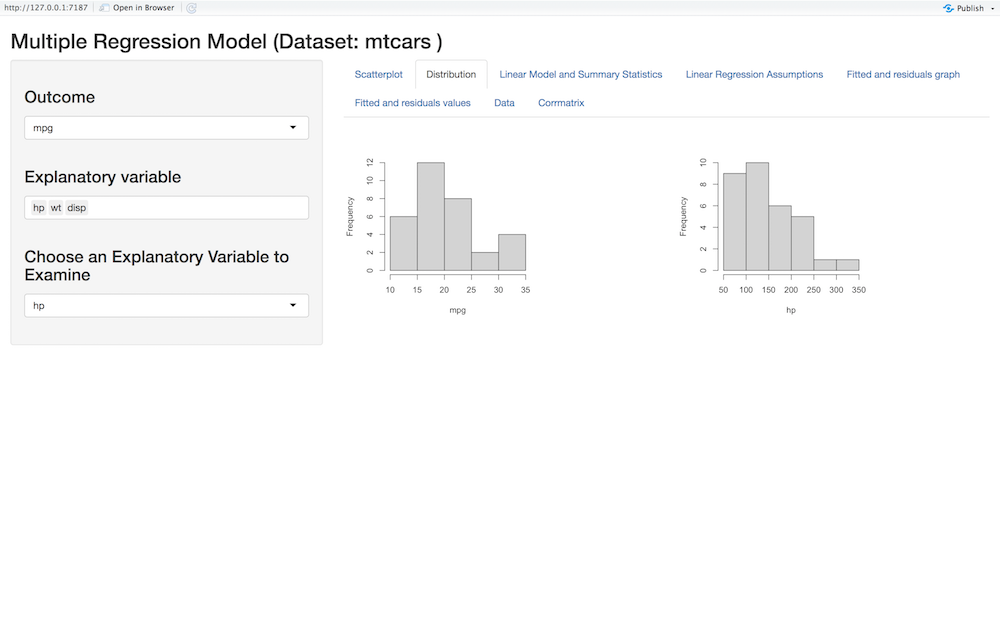
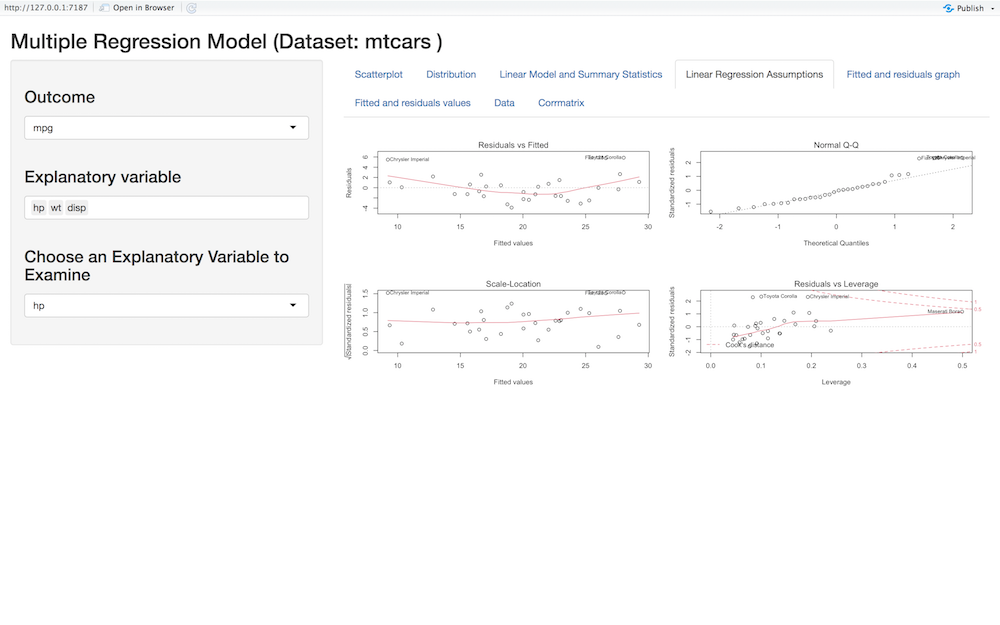

**Overview**

This package was created in order to simplify the process of running simple linear, multiple linear, and stepwise regression models. This package offers an interactive application for each model, and allows the user to perform regressions faster and much easier without any coding experience. The user simply input the dataset wanted to analyze in the function, and a pop up interactive application appears, where they can simply choose their outcome and independent variable.  

**Usage**

Install package with:

```{r, eval=FALSE}

# The easiest way to get interreg is to install it from the development version from GitHub:
if(!require(devtools)){
  install.packages("devtools")
}
devtools::install_github("aaldarmaki9/interreg")

```


Load interreg package with:
```{r, eval=FALSE}
library(interreg)
```

**There are three main functions for this package. Each function uses the Shiny app to create an interactive experience for running regression models. The three models are:**

1. Simple Linear Regression
2. Multiple Linear Regression
3. Stepwise Regression


**Run Simple Linear Regression interactively with slreg Function**

To run an interactive simple linear regression with interreg you can do it by using the **slreg** function by simply specifying the dataset, and an interactive shiny application will pop up where you can easily choose the variables you want and change them so easily and quickly. The slreg will output:

1. Interactive data table 
2. Data summary statistics and model summary
3. Interactive scatter plot with regression line to observe the relationship between the independent and dependent variable of your choice individually
4. Interactive distributions of the variables in the inputted dataset
5. Linear regression assumption plots
6. Fitted and residuals graphs 
7. Fitted and residuals values
8. Correlation Visualization Matrix

The following example runs an interactive simple linear regression with the **slreg** function:

```{r, eval=FALSE}
slreg(swiss)

```

**Run Multiple Linear Regression interactively with multreg Function**

To run an interactive multiple linear regression with interreg you can do it by using the **multreg** function by simply specifying the dataset, and an interactive shiny application will pop up where you can easily choose the variables you want and change them so easily and quickly. The multreg will output:


1. Interactive data table 
2. Data summary statistics and model summary
3. Interactive scatter plot with regression line to observe the relationship between the independent and dependent variable of your choice individually
4. Interactive distributions of the variables in the inputted dataset
5. Linear regression assumption plots
6. Fitted and residuals graphs 
7. Fitted and residuals values
8. Correlation Visualization Matrix

The following example runs an interactive simple linear regression with the **multreg** function:

```{r, eval=FALSE}
multreg(mtcars)

```

**Run Stepwise regression interactively with stepreg Function**

To run an interactive stepwise regression with interreg you can do it by using the **stepreg** function by simply specifying the dataset, and an interactive shiny application will pop up where you can easily choose the your outcome variable and the method that you want and change it so easily and quickly. The stepreg will output:


1. Interactive data table 
2. Data summary statistics and model summary
3. Interactive scatter plot to observe the relationship between the independent and dependent variable of your choice individually
4. Distributions of all the variables in the inputted dataset
5. Linear regression assumption plots
6. Fitted and residuals graphs 
7. Fitted and residuals values
8. Correlation Visualization Matrix

The following example runs an interactive stepwise regression with the **stepreg** function:

```{r, eval=FALSE}
stepreg(Boston)

```


**Example: An Overview of the Multreg function output**


1. Interactive data table 


2. Data summary statistics and model summary


3. Interactive scatter plot to observe the relationship between the independent and dependent variable of your choice


4. Interactive distributions of the variables in the inputted dataset





5. Linear regression assumption plots




6. Fitted and residuals graphs


7. Fitted and residuals values


8. Correlation Visualization Matrix


